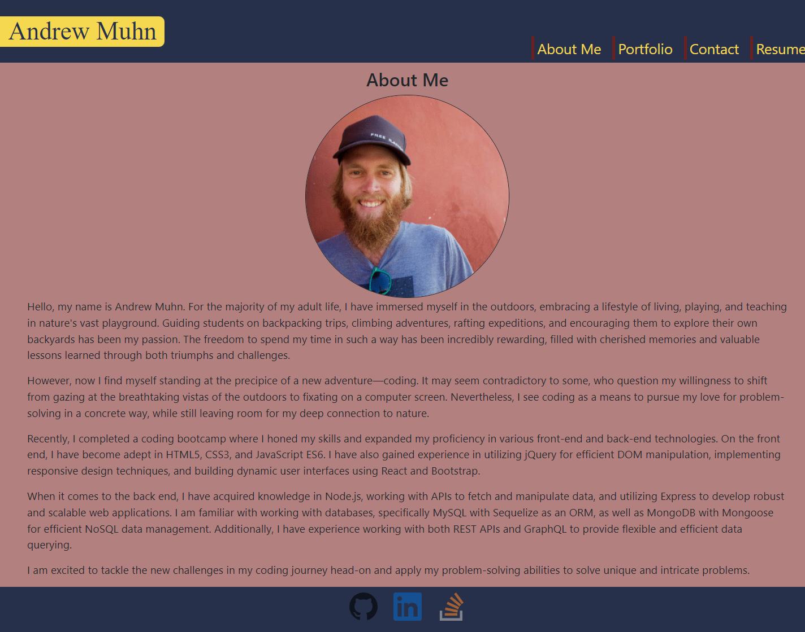
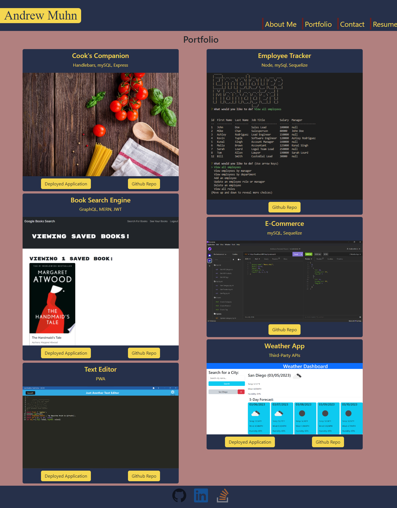
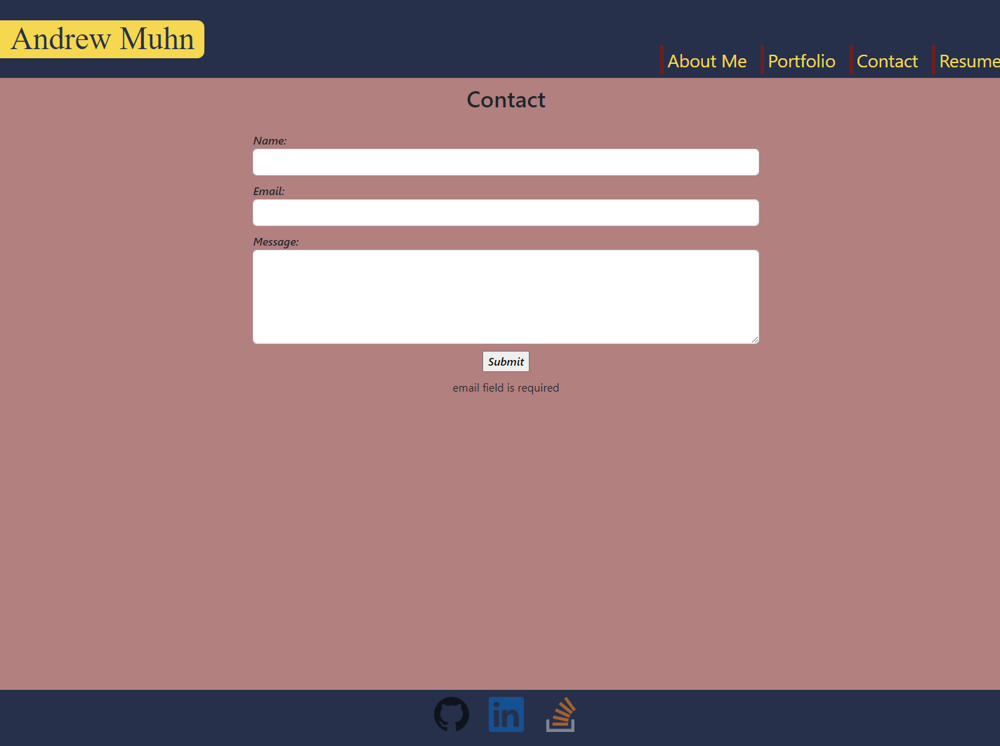
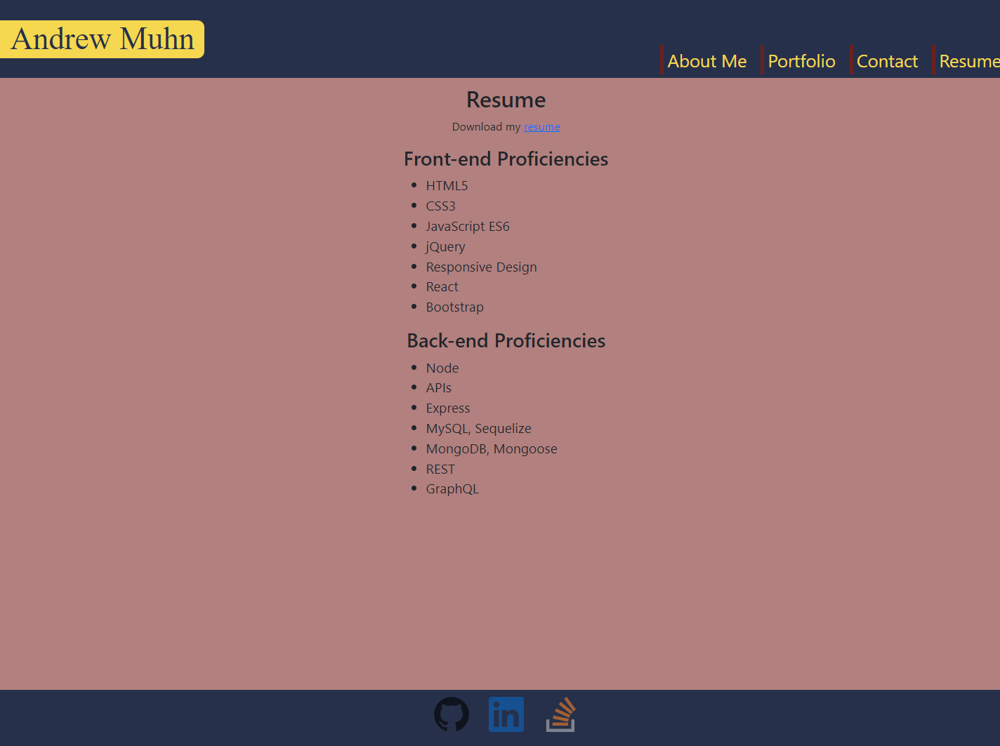

# Muhn, Andrew Portfolio

## Description

- This single page REACT application serves as my Portfolio.
- In addition to being a functional portfolio it also was developed to practice creating front end applications using react.

## Table of Contents

- [Usage](#usage)
- [Credits](#credits)

## Usage

This application is deployed at:

[Muhn, Andrew Portfolio](https://andrewmuhn.github.io/muhn-a-react-portfolio/)

The repo can be found at:

[github repo](https://github.com/andrewmuhn/muhn-a-react-portfolio)

Page appearances:

## Credits

![edX][edX]

Project created by [Andrew Muhn](https://github.com/andrewmuhn)
as part of UofO Edx Bootcamp

Utilized:

- [![React][React.js]][React-url]
- [![Bootstrap][Bootstrap.com]][Bootstrap-url]

<!-- MARKDOWN LINKS & IMAGES -->

[edX]: https://img.shields.io/badge/edX-%2302262B.svg?style=for-the-badge&logo=edX&logoColor=white
[React.js]: https://img.shields.io/badge/React-20232A?style=for-the-badge&logo=react&logoColor=61DAFB
[React-url]: https://reactjs.org/
[Bootstrap.com]: https://img.shields.io/badge/Bootstrap-563D7C?style=for-the-badge&logo=bootstrap&logoColor=white
[Bootstrap-url]: https://getbootstrap.com
